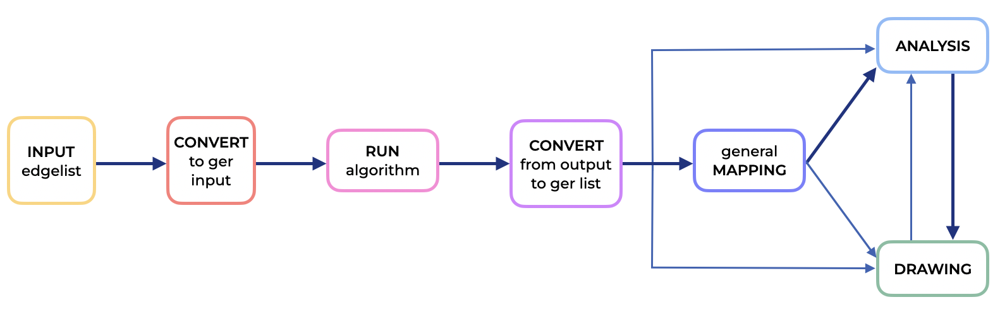

# geranio


GERANIO: Graph Evolution Rules ANalytics vIsualization tOolkit

GERANIO is a comprehensive toolkit designed to facilitate the application, visualization and analysis of graph evolution rules algorithms. 
Graph evolution rules capture interpretable patterns describing the transformation of a small subgraph into a new subgraph, providing valuable insights into evolutionary behaviors. This repository provides a set of modules to help you prepare input data in the right format, run algorithms, read the output, and analyze and visualize the results.

## Key Features
The following pipeline describes the process:

 

- **Input Preparation**: GERANIO includes tools to streamline the process of formatting your input data to suit your analysis needs.

- **Algorithm Execution**: With GERANIO, you can easily run a variety of graph evolution algorithms to gain insights into the changes within your networks or graphs.

- **Output Reading**: The toolkit offers functions for reading and interpreting the results generated by the algorithms.

- **Analysis and Visualization**: GERANIO provides modules to help you analyze and visualize the evolution of graphs and networks over time. Understand the patterns, trends, and anomalies in your data.

## Getting Started

To get started with GERANIO, you can follow the process described in the jupyter notebook ```geranio.ipynb```


